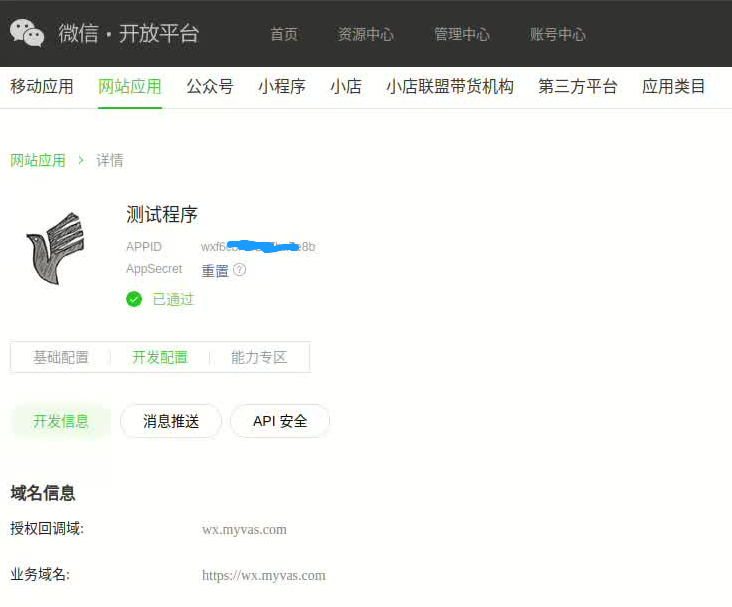

# Myvas.AspNetCore.Authentication Family 

* QQConnect (QQ互联平台/QQ身份登陆): [Here](https://github.com/myvas/AspNetCore.Authentication.QQConnect)

[](https://github.com/myvas/AspNetCore.Authentication.QQConnect)
[](https://github.com/myvas/AspNetCore.Authentication.QQConnect/actions/workflows/test.yml)
[](https://github.com/myvas/AspNetCore.Authentication.QQConnect/actions/workflows/publish.yml)
[](https://www.nuget.org/packages/Myvas.AspNetCore.Authentication.QQConnect)

* WeixinOpen （微信开放平台/微信扫码登录）: _this repo_

[](https://github.com/myvas/AspNetCore.Authentication.WeixinOpen)
[](https://github.com/myvas/AspNetCore.Authentication.WeixinOpen/actions/workflows/test.yml)
[](https://github.com/myvas/AspNetCore.Authentication.WeixinOpen/actions/workflows/publish.yml)
[](https://www.nuget.org/packages/Myvas.AspNetCore.Authentication.WeixinOpen)

* WeixinAuth （微信公众号/公众号内静默登录）: [Here](https://github.com/myvas/AspNetCore.Authentication.WeixinAuth)

[](https://github.com/myvas/AspNetCore.Authentication.WeixinAuth)
[](https://github.com/myvas/AspNetCore.Authentication.WeixinAuth/actions/workflows/test.yml)
[](https://github.com/myvas/AspNetCore.Authentication.WeixinAuth/actions/workflows/publish.yml)
[](https://www.nuget.org/packages/Myvas.AspNetCore.Authentication.WeixinAuth)

## What's this?
An ASP.NET Core authentication middleware for https://open.weixin.qq.com (微信开放平台/微信扫码登录)
* 须微信开放平台(open.weixin.qq.com)账号。
* 用户可使用微信扫码并确认后登入网站。

## How to Use?
### 0.创建微信开放平台账号，创建并配置一个应用（移动应用、网站应用、公众号、小程序等）
在微信开放平台(https://open.weixin.qq.com)上创建网站应用，获取“APPID”和“AppSecret”，并配置【授权回调域】。建议同时配置业务域名。
- 【授权回调域】（例如：wx.myvas.com)
  - 在该域名下部署的网站可以使用本组件进行身份验证。
  - 可以在多个虚拟目录下同时部署多个网站。
  - 该项配置的域名是确定的，不会通配到本域名下的二级子域名上生效。
  - 该项配置不限定协议，您可以采用HTTP或HTTPS都行。
  - 配置中的CallbackPath可以直接使用默认配置。因为它的“根”是您的网站部署的地址，这个地址已经包含虚拟目录（如果有），因此，基本上不太可能与您的网站中已有网页路由地址冲突。
- 【业务域名】（例如：https://wx.myvas.com）
  - 部署在该域名下的网站，可以使用本组件验证后的身份去访问任意PC小程序和分享小程序。
  - 业务域名必须指定协议，最多只能指定3个业务域名。

（如图所示）


### 1.在您的程序中引用NuGet包
* [Myvas.AspNetCore.Authentication.WeixinOpen](https://www.nuget.org/packages/Myvas.AspNetCore.Authentication.WeixinOpen)

### 2.在您的程序中配置服务（ConfigureServices）
```csharp
services.AddAuthentication()
    // using Myvas.AspNetCore.Authentication;
    .AddWeixinOpen(options => 
    {
        options.AppId = Configuration["WeixinOpen:AppId"];
        options.AppSecret = Configuration["WeixinOpen:AppSecret"];

        options.CallbackPath = "/signin-weixinopen"; //默认
    };
```

### 3.在您的程序中使用身份验证（ConfigurePipeline）

```csharp
    app.UseAuthentication();
```

### 4.在您的程序中触发身份验证组件（自动触发或在登陆页中放个链接）

## 其他说明

1. 同一用户在同一微信公众号即使重复多次订阅/退订，其OpenId也不会改变。
2. 同一用户在不同微信公众号中的OpenId是不一样的。
3. 若同时运营了多个微信公众号，可以在微信开放平台上开通开发者账号，并在“管理中心/公众账号”中将这些公众号添加进去，就可以获取到同一用户在这些公众号中保持一致的UnionId。

# For Developers
* [Visual Studio Code](https://code.visualstudio.com)
* [Visual Studio 2022](https://visualstudio.microsoft.com)
* [.NET Core 3.1](https://dotnet.microsoft.com/download/dotnet-core/3.1)
* [.NET 5.0](https://dotnet.microsoft.com/download/dotnet-core/5.0)
* [.NET 6.0](https://dotnet.microsoft.com/download/dotnet-core/6.0)
* [.NET 7.0](https://dotnet.microsoft.com/download/dotnet-core/7.0)
* [.NET 8.0](https://dotnet.microsoft.com/download/dotnet-core/8.0)
* [.NET 9.0](https://dotnet.microsoft.com/download/dotnet-core/9.0)
* [微信开发者工具](https://mp.weixin.qq.com/debug/wxadoc/dev/devtools/download.html)
* [微信开放平台](https://open.weixin.qq.com)

# Demo
* https://wx.myvas.com
